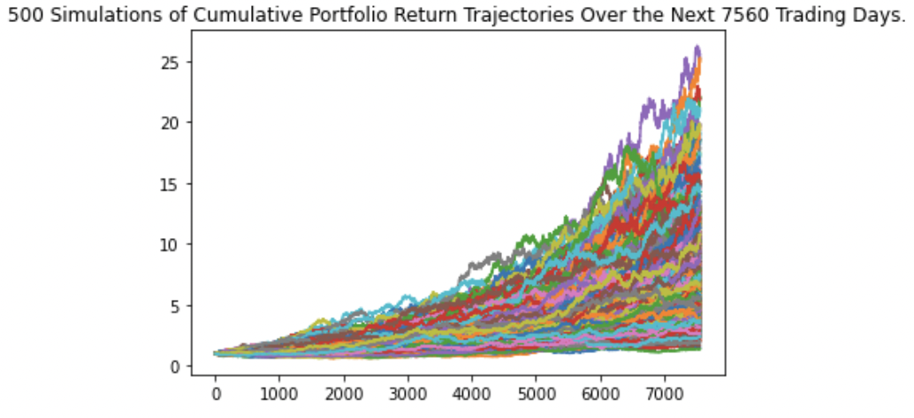
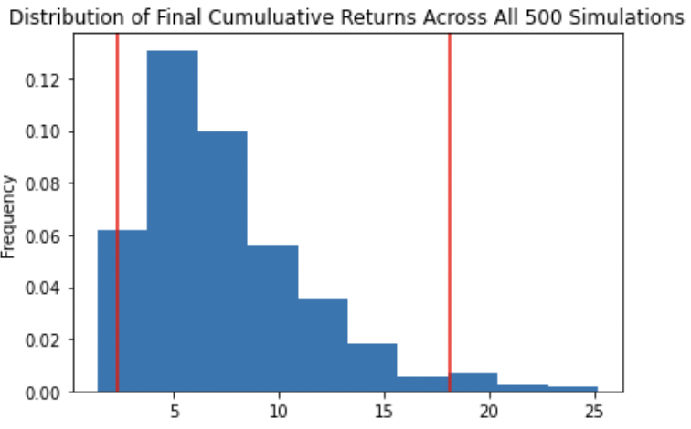
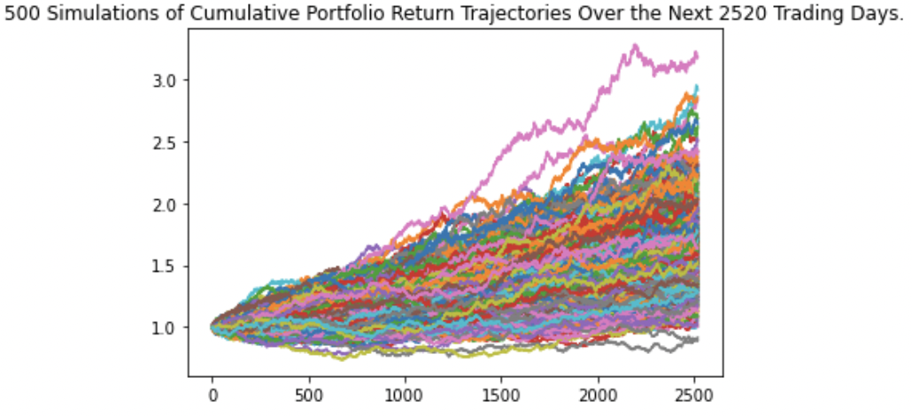
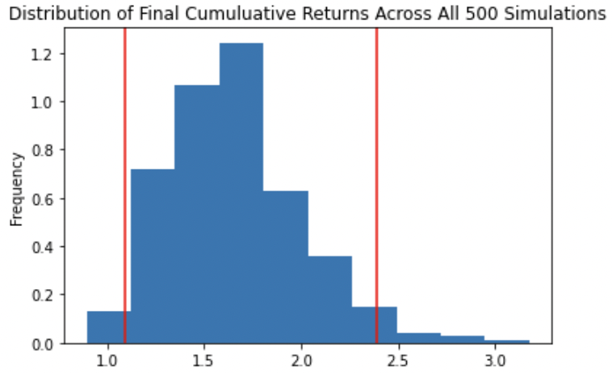

# 05_Financial_Planners

### This section includes two financial analysis tools to plan for an emergency fund and to plan for retirement.

1. A financial planner for emergencies: clients can use this tool to visualize their current savings and determine if they have enough reserves for an emergency fund.

2. A financial planner for retirement: clients can forecast the performance of their retirement portfolio in 30 years using the Alpaca API and running the Monte Carlo simulations.

---

## Technologies

This project leverages python 3.9 and Jupyter lab notebook was used to run all analysis.

This project also used APIs (Application Programming Interface) to extract data from financial service providers, specifically [Alpaca](https://github.com/alpacahq/alpaca-trade-api-python). Make sure to have your Alpaca Keys ready by [creating an account here](https://alpaca.markets/).

---

## Installation Guide

Before running the application first import the following libraries and dependencies.

```python
import os
import requests
import json
import pandas as pd
from dotenv import load_dotenv
import alpaca_trade_api as tradeapi
from MCForecastTools import MCSimulation

%matplotlib inline
```

---

## Financial Planner for Emegencies: Evaluate the cryptocurrency wallet

To determine a client's **cryptocurrency wallet value**, we will collect prices for the Bitcoin and Ethereum cryptocurrencies by using the Python Requests library. Let's assume that the client holds 1.2 BTC (Bitcoins) and 5.3 ETH (Ethereum coins) and the monthly income is $12000.

Below are the free Crypto API Call endpoint URLs we used when making an API call to access the current prices:

```python
btc_url = "https://api.alternative.me/v2/ticker/Bitcoin/?convert=USD"
eth_url = "https://api.alternative.me/v2/ticker/Ethereum/?convert=USD"
```

To make the API call, use the following functions to load your environment variables (Alpaca API key and secret key) and using the Python requests library to access the current prices of the cryptocurrencies. Use the `json.dumps()` function to review the response:

```python
load_dotenv()

alpaca_api_key = os.getenv("ALPACA_API_KEY")
alpaca_secret_key = os.getenv("ALPACA_SECRET_KEY")

display(type(alpaca_api_key))
display(type(alpaca_secret_key))

crypto_response = requests.get("crypto_url").json()
print(json.dumps(crypto_response, indent=4, sort_keys=True))

```

After determining each cryptocurrency's current price and finding the total value based on current holdings, we saved it into a variable **total_crypto_wallet** so we can use it for analysis later on when looking at the entire Emergency Fund when including the stocks and bonds' value.

---

## Financial Planner for Emegencies: Evaluate the Stock and Bond holdings

To determine the client's **stock and bond holdings**, we followed the same set up as before but also created the Alpaca `tradeape.REST()` object so your account information is entered in order to retrieve data. Let's assume that the client holds 200 shares of AGG and 110 shares of SPY.

Use the `get_barset()` function to get the current closing prices for the portfolio, in which you use one day as the timeframe where the format is set to the ISO format (date can be the last trading day).

Then, based on the client's current holdings of AGG and SPY, their total value was evaluated and saved as the variable **total_stocks_bonds** so we can add this and **total_crypto_wallet** to create the overall value of the portfolio, which we named the variable as **total_portfolio**. Total portfolio's amount was $130095.65.

Finally, to evaluate the **total_portfolio**, we compared it to the **emergency_fund_value**, which is set to be three times the "month_income" of $12000 (i.e., $36000). This was done by a serires of if statements to determine if the client's total portfolio is large enough to fund the emergency portfolio:

```python
* If the total portfolio value is greater than the emergency fund value, display a message congratulating the member for having enough money in this fund.

* Else if the total portfolio value is equal to the emergency fund value, display a message congratulating the member on reaching this important financial goal.

* Else the total portfolio is less than the emergency fund value, so display a message showing how many dollars away the member is from reaching the goal. (Subtract the total portfolio value from the emergency fund value.)
```

Luckily, with the client's current holdings, s/he **has enough money in the fund**! The overall portfolio held a total amount of $130095.65, which is greater than the emergency fund of $36000.

---

## Financial Planner for Retirement: Using Monte Carlo simulations to plan for retirement

We will run two Monte Carlo simulations of 500 samples:

1. To forecast the client's traditional 40/60 portfolio for 30 years: 40% bonds (AGG) and 60% stocks (SPY).
2. To forecast the client's 20/80 portfolio for 10 years: 20% bonds (AGG) and 80% stocks (SPY).
   - The purpose of this forecast is to see if the client can retire in 10 years if adjusted his strategy to 20/80.

First, we made an API call via the Alpaca SDK to get the 3 years of historical closing prices for a traditional 40/60 portfolio split. We saved this into a dataframe, `prices_df`, and used this when we ran the simulations using the function `MCSimulation()`.

For both simulations, the following were used to run the 30- and 10-year simulationas and to calculate cumulative returns. The 30-year weights and year are used in the following example:

```python
MC_4060_weight = MCSimulation(
    portfolio_data = prices_df,
    weights = [.60, 0.40],
    num_simulation = 500,
    num_trading_days = 252*30
)

MC_4060_weight.calc_cumulative_return()
```

Afterwards, we then plotted them to get a visualization of the forecasts:

**30-year, 40/60 portfolio**




**10-year, 20/80 portfolio**




The summary statistics for each simulation was also produced to calculate the range of possible outcomes using the lower and upper 95% confidence intervals multiplied by the **total_stocks_bonds** variable. Their results were compared to determine if the client can retire early if s/he shifted the weights of the portfolio to emphasize more on stocks.

- **For the 40/60, 30-year simulation**: there is a 95% chance that an initial investment of $70640.1 in the portfolio with a 40% weight in AGG and 60% in SPY over the next 30 years will end within the range of $172851 and $1294715.

- **For the 20/80, 10-year simulation**: there is a 95% chance that an initial investment of $70640.1 in the portfolio with a 20% weight in AGG and 80% in SPY over the next 10 years will end within the range of $77356 and $169127.

**In conclusion**, the financial tools have indicated that the client cannot retire early even if s/he changed the strategy by adjusting the weights to focus more on stocks. This is a good financial tool to test out your retirement strategies.
